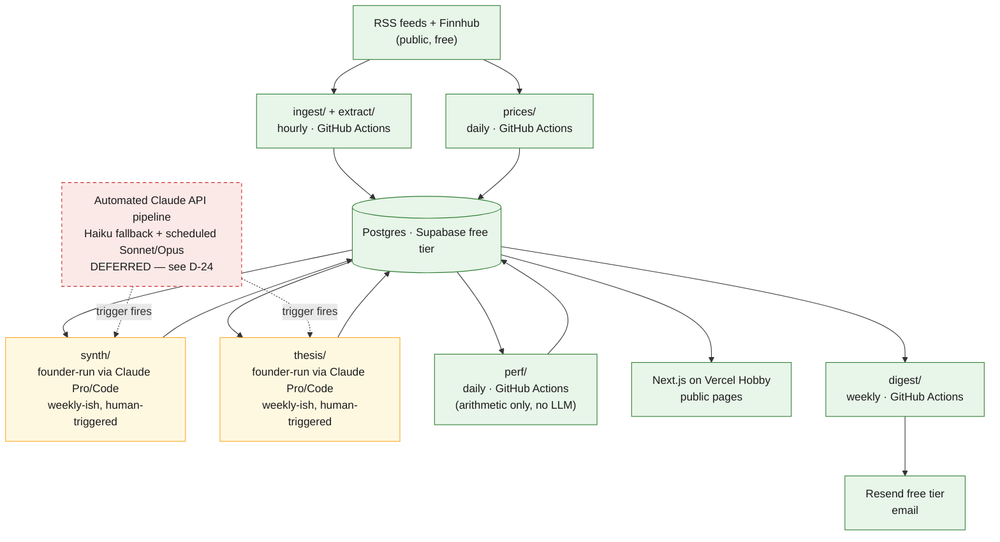

# ADR-0002 — Free-tier-first MVP

**Status:** Accepted
**Date:** 2026-07-24
**Context:** Founder-directed cost constraint applied to the already-agreed plan in `ADR-0001-mvp-scope-and-architecture.md`.
**Decision owners:** founder + technical co-founder
**Relationship to ADR-0001:** Does not reopen Parts I–V. Product scope, architecture shape, milestones, and quality gates stand exactly as decided there. This ADR governs *how* that plan gets implemented and *in what order*, under a constraint ADR-0001 didn't fully anticipate. Decisions below continue ADR-0001's numbering (D-19 onward) so both documents share one decision registry; cite them as "ADR-0002, D-XX."

---

## Context

Topicron is currently a hobby project. The founder does not want recurring infrastructure costs. The only paid, recurring tools are Cursor and Claude Pro. Every other component of the stack must run on a permanently free tier of a hosted service, or locally on the founder's own machine, or must not be built yet.

This tightens something ADR-0001 already gestured at — MVP philosophy #5, "defer with a trigger, not a wish" — into a hard line, and it's worth being precise about what's actually new, because it's easy to mistake this ADR for a restatement of existing frugality. `docs/AI_SYSTEM.md`'s cost model treats roughly $13–25/month of Claude API spend as acceptable, on the grounds that it's a *hobby-scale expense, not a problem-scale one*. That reasoning is sound on its own terms — the number really is small — but it answers a different question than the one now being asked. The founder isn't asking "is this affordable." The founder is asking "does this introduce a new recurring vendor relationship beyond Cursor and Claude Pro." By that test, $13/month routed through the Batch API is exactly as disqualifying as $130/month would be. Small and zero are different categories here, not points on the same scale.

## The conflict this ADR exists to resolve

Before any of the decisions below: **the AI pipeline as specified today cannot run under this constraint, and Claude Pro does not close the gap on its own.**

Anthropic's own documentation is explicit that a Pro subscription does not include usage of the Claude API through the Console — API access is a separate account, billed separately, at the per-token rates `docs/AI_SYSTEM.md`'s cost model already cites. So `extract/`, `synth/`, and `thesis/` as currently designed — scheduled GitHub Actions jobs calling Haiku 4.5, Sonnet 5, and Opus 4.8 directly — would open exactly the kind of new metered vendor bill this ADR is meant to prevent, regardless of how small ADR-0001 correctly calculated it to be. This is a real, previously-unflagged conflict between ADR-0001's cost model and the constraint stated here, not a minor wording issue, and it deserves to be named plainly rather than papered over.

There is a real way out, and it's a good one. Claude Code is bundled into the Pro plan at no extra charge, drawing from the same usage pool as claude.ai chat, and it runs inside Cursor itself — Cursor is one of the IDEs Anthropic explicitly supports it in. That means the founder already owns, today, a way to run Claude-quality structured extraction, topic synthesis, and thesis generation, using a tool already paid for, at zero incremental cost — just not as an unattended background job. One sharp edge worth flagging now, before it causes a silent bill: if an `ANTHROPIC_API_KEY` environment variable is present anywhere Claude Code runs, it silently switches to metered API billing instead of the subscription, with no separate warning. Keep that variable unset on any machine or shell profile used for this project.

The resolution below (D-20) isn't "find a workaround." It's "do exactly what the founder already said was acceptable": run this locally, by hand, using Cursor and Claude Pro.

---

## Decision

### D-19 — Free-tier-first as a standing constraint

**Decision:** For as long as Topicron is a pre-revenue hobby project, no component may be added to the stack that introduces a new recurring, metered, or subscription cost beyond Cursor and Claude Pro. Every other piece runs on a permanently free service tier, or locally, or isn't built yet.

**Why:** Stated directly by the founder, and consistent with ADR-0001's existing "defer with a trigger, not a wish" principle — this makes the trigger for *this specific category* of deferral ("does it cost anything recurring") explicit and absolute, rather than a case-by-case judgment call against a dollar figure.

**Impact:** An implementation constraint, not a scope change. Nothing moves from in-scope to out-of-scope in `docs/MVP_SCOPE.md`. What changes is *who or what executes* certain already-agreed pipeline stages, and *how often*.

**Documentation change:** `docs/MVP_SCOPE.md` — add a line near the top noting that, per this ADR, every "in scope" item is additionally constrained to run on free infrastructure or locally until a D-24 reinstatement trigger is met.

---

### D-20 — The AI pipeline moves from unattended-and-billed to founder-run-and-free

**Decision:** `extract/`'s LLM fallback, `synth/`, and `thesis/` stop being scheduled GitHub Actions jobs calling the Claude API directly. They become sessions the founder runs personally — in Cursor or a terminal via Claude Code under the existing Pro subscription, or in claude.ai chat/Projects directly — at a cadence the founder sets rather than a fixed cron schedule. A sensible starting cadence is roughly weekly, not the original hourly/6-hourly/daily automation; the milestone table below explains why that isn't actually a downgrade at current traffic levels.

The prompts, output schemas, and hallucination-mitigation contracts in `docs/AI_SYSTEM.md` don't change at all — same structured JSON, same hedged language, same citation-as-paraphrase-never-quote rule, same "hypothesis, not advice" caveat field. Only the executor and the cadence change. That's deliberate: turning the automated version back on later (D-24) becomes a configuration and infrastructure change, not a rewrite.

Two supporting simplifications:

- **`extract/`'s LLM fallback is deferred, not replaced.** Rule-based ticker/company matching was already described as handling "most cases" (`docs/AI_SYSTEM.md`, Agent 1) — the LLM was only ever a fallback for ambiguous collisions like "ALL," "ARE," or "IT" being both English words and real tickers. For the free-tier MVP, ambiguous cases are logged, not silently dropped or resolved by a model call — the founder can review the log during the same session used for synthesis and thesis work. This keeps the gap visible and auditable rather than quietly degrading extraction quality, in keeping with the existing "halt and log, never degrade silently" instinct already present elsewhere in this documentation set.
- **A one-time API trial credit exists and is worth using once, not relying on.** A fresh Anthropic Console account gets a small one-time trial credit after phone verification (on the order of a few dollars) — enough to sanity-check the pipeline's behavior against the real API exactly once, but not a sustainable substitute for an ongoing free tier. Treat it as a one-time validation tool, not part of the ongoing plan.

**Why:** This is the only piece of the existing architecture that structurally cannot run at $0/month as specified — every other service in `docs/TECH_STACK.md` already has a genuine, sustainable free tier (D-21, below). Claude Code under the existing Pro subscription is the closest available thing to "the same pipeline, the same quality bar, zero incremental cost" — it just requires the founder in the loop instead of a scheduler.

**Impact:** M2's "no UI" pipeline becomes "founder-operated pipeline, no UI" — the deliverables in `docs/ROADMAP.md` M2 don't change, only who triggers them. This isn't pure cost avoidance, either: manually running synthesis and thesis generation for longer than originally planned puts a human in the loop for exactly the stage `docs/RISKS.md` already calls the single biggest execution risk ("Generic output," AI slop). More founder eyes on more generations, for longer, is a plausible net quality win, not just a constraint being tolerated.

**Documentation change:** `docs/AI_SYSTEM.md` — add a "Free-tier-first execution mode" note under Agent 2 and Agent 3 describing the founder-run/Claude-Code path as the MVP default, with the original scheduled-job description retained as the state the pipeline moves to once D-24's trigger fires. `docs/ARCHITECTURE.md` — mark `synth/` and `thesis/` as human-triggered, not cron-scheduled, in the background jobs table, for now. `docs/TECH_STACK.md` — move "Claude API (automated pipeline)" from "In the MVP" to the deferred table, with the D-24 trigger.

---

### D-21 — The rest of the hosted stack already clears the bar; ceilings and upgrade triggers made explicit

**Decision:** Vercel, Supabase, GitHub Actions, Resend, Sentry, and PostHog stay exactly as chosen in `docs/TECH_STACK.md` — every one of them has a genuine, indefinite free tier suitable for this project's current scale, confirmed below rather than assumed. What's new is naming each one's specific ceiling and upgrade trigger, so hitting one is a recognized signal rather than a surprise:

| Service | Free-tier ceiling that matters here | Upgrade trigger |
|---|---|---|
| Vercel (Hobby) | Generous bandwidth/compute for MVP-scale public traffic — but Hobby's terms restrict it to non-commercial, personal use, and Vercel enforces this | The same trigger `docs/MVP_SCOPE.md` already sets for monetization (counsel review). No new gate — this one rides along with a decision already made |
| Supabase (Free) | 500MB database, 5GB egress/month, 500K edge function invocations/month, 2 active projects per org, **project pauses after 7 days with no database activity** | Approaching 500MB (unlikely for years at this content volume), or the pause becoming operationally annoying (see D-23) |
| GitHub Actions | Unlimited, genuinely free minutes on standard runners — confirmed: this only applies because the repo is public, which it is | Never, at this scale, as long as the repo stays public |
| Resend (Free) | 3,000 emails/month, **100/day**, one verified sending domain | Subscriber count alone can trip this — see the M3 note below, since "100+ subscribers" is already an explicit milestone target |
| Sentry (Developer) | 5,000 error events/month, 1 user, 30-day retention | A single founder is within the 1-user limit by construction; watch the event count if a bad deploy spikes it |
| PostHog (Free) | 1M analytics events/month, 5K session replays/month | Far beyond MVP-stage traffic; not a near-term concern |

**Why:** Naming the ceiling now means an upgrade, if it ever happens, is a deliberate response to a named signal — exactly the discipline ADR-0001 already applies to every other deferred decision in this project — rather than a surprised scramble when a page starts returning errors.

**Impact:** No architecture change. This decision converts implicit assumptions ("Vercel's probably fine") into explicit, checkable facts.

**Documentation change:** `docs/TECH_STACK.md` — add the ceiling/trigger detail above to each service's existing entry.

---

### D-22 — A domain name is the one cost this ADR can't make disappear

**Decision:** Accept a small annual domain registration cost (typically $10–15/year) as outside the scope of "recurring infrastructure cost" this ADR is meant to prevent, rather than trying to avoid it entirely.

**Why:** Resend's free tier requires verifying a domain the founder actually controls before it can send to anyone other than the account owner — this isn't a Resend quirk; every transactional email provider requires DNS-level domain verification for deliverability. A `*.vercel.app` URL can't be verified this way, because Vercel, not the founder, controls that domain's DNS. A real domain is a functional requirement for the weekly digest to work at all, independent of this ADR, and was always going to be needed by M3 for a public, shareable, credible research publication regardless of the cost constraint. If the founder already owns any domain for any other purpose, a subdomain of it costs nothing further — worth checking before buying a new one.

**Impact:** A roughly $1/month-equivalent, once-a-year charge — not a recurring vendor relationship in the sense this ADR targets (no monthly bill, no usage meter, no risk of a runaway charge). If avoiding literally every dollar outweighs the digest working, the fallback is to defer the email digest specifically until this feels worth it, while public pages still work on a `*.vercel.app` URL — but that trades away the owned distribution channel `docs/RISKS.md` already calls the single largest omission in the original plan.

**Documentation change:** None required — this doesn't change any existing document's claims, it just makes an implicit cost explicit.

---

### D-23 — Free-tier dormancy is an accepted operating condition, not an incident

**Decision:** Two specific free-tier behaviors are named here so they're recognized as normal, not treated as bugs when they happen:

1. **GitHub Actions disables scheduled workflows in a public repository after 60 days with no *commits*** — not no job runs, no commits specifically. A pipeline that's running perfectly, writing to Supabase every hour, still goes quiet if the founder simply doesn't push code for two months. A single lightweight keepalive workflow (a scheduled job that touches a timestamp file and commits it, run monthly) closes this for near-zero effort; several open-source actions already do exactly this. Absent that, manually re-enabling the workflow from the Actions tab after a quiet stretch is an acceptable, occasional task.
2. **Supabase pauses a free project after 7 days with no database activity.** In practice, as long as the scheduled jobs are running, the pause never triggers — hourly ingestion alone easily clears it. It only becomes relevant *after* GitHub Actions has already gone quiet for the reason above — it's the second domino, not the first. Resuming a paused project is a one-click action in the dashboard with roughly a 30-second cold start.

**Why:** Both are well-documented, common behaviors of running on free infrastructure, not defects in this specific plan. Naming them now means a multi-week gap in founder attention (a busy month, a vacation) reads as "expected, five minutes to fix" instead of "something's broken."

**Impact:** None on scope. This is purely about setting correct expectations for a solo, part-time hobby project's actual usage pattern.

**Documentation change:** `docs/ARCHITECTURE.md` — add a short "Free-tier operating notes" subsection under Background jobs documenting both behaviors and the keepalive mitigation.

---

### D-24 — Reinstatement trigger for the automated, paid pipeline

**Decision:** The automated Claude-API-driven pipeline (scheduled `synth/`/`thesis/`, plus the Haiku extraction fallback) is deferred, not cancelled, per ADR-0001's own "defer with a trigger, not a wish" principle. It comes back when any one of the following is true:

| Signal | What it means |
|---|---|
| Real revenue exists | Mirrors the trigger `docs/MVP_SCOPE.md` already sets for monetization generally — self-funds the ~$13–25/month `docs/AI_SYSTEM.md` already estimated |
| Founder-run sessions consistently exceed ~3–4 hours/week | The manual mode has become the bottleneck rather than a deliberate choice — track actual time spent as the signal, don't guess |
| Content or thesis volume outgrows what one session can responsibly cover | A capacity ceiling, distinct from a time-cost one |
| The founder simply decides the small, known cost is worth paying | Legitimate on its own — nothing above implies the number is unaffordable, only that zero new recurring vendor relationships was the explicitly stated preference during this phase |

**Why:** Consistent with how every other deferred item in this project is already handled — a written condition, not an indefinite "later."

**Impact:** When triggered, re-enabling the original scheduled-job design is a config and infrastructure change (add the API key as a GitHub Actions secret, re-enable the cron triggers, re-enable the Haiku fallback path), not a rewrite — because D-20 deliberately kept the prompts and schemas identical. The daily spend cap and kill-switch already specified in `docs/AI_SYSTEM.md` (ADR-0001, D-16) should still be written into the codebase at that point, even though it's dormant until then — don't skip it just because it isn't load-bearing yet.

**Documentation change:** `docs/MVP_SCOPE.md` — add "Claude API (automated, unattended pipeline)" as a new row in the existing Deferred table, with this trigger.

---

## System diagram (free-tier-first state)

Green = automated, unattended, and free. Amber = founder-run, manual, and free. Red/dashed = the deferred, paid state this pipeline moves to once D-24 fires.

---

## What does not change

Nothing here touches product scope, architecture shape, milestone gates, or the regulatory posture:

- Every item in `docs/MVP_SCOPE.md`'s in-scope list is still in scope.
- The seven-table-plus-two-joins schema in `docs/DATA_MODEL.md` is unchanged.
- The 90-day holding rule, dual benchmarks, and evaluation-by-real-market-data (never LLM-graded) all stand exactly as ADR-0001 decided.
- `docs/ROADMAP.md`'s milestone gates — what has to be *true* to pass M0, M2, M5, and so on — are unchanged. What changes is who or what performs some of the work behind M2's deliverables, not the bar M2 has to clear.
- Nothing here weakens `docs/RISKS.md`'s regulatory analysis; if anything, more founder review of AI-generated theses for longer strengthens the "bona fide, non-generic commentary" posture that analysis depends on.

---

## Manual steps accepted during the free-tier-first MVP

- Running `synth/` and `thesis/` generation personally, via Claude Code (in Cursor or a terminal) or claude.ai, at a founder-set cadence instead of on a fixed schedule (D-20).
- Reviewing the logged ambiguous-ticker cases from rule-based extraction periodically, instead of an automatic Haiku fallback resolving them (D-20).
- Loading generated topics/theses into Supabase by hand — via Supabase Studio's SQL editor, or a small local script using the service-role key run from the founder's own machine — instead of a job writing them automatically.
- Occasionally re-enabling a GitHub Actions workflow after a quiet stretch, if the optional keepalive job isn't set up (D-23).
- Occasionally clicking "resume" on a paused Supabase project, in the rare case D-23's first domino falls too (D-23).
- Running the golden-set regression check from `docs/AI_SYSTEM.md` by hand before a prompt change, rather than as an automated CI gate — same check, no longer unattended.
- Buying and pointing DNS for one domain, a single annual task rather than a recurring one (D-22).

None of these are new burdens invented by this ADR — most were already manual under ADR-0001 (RSS feed curation, weekly manual QA sampling, the M0 concierge test), or are the direct, named cost of not paying for automation elsewhere. Naming them here is what keeps them from being discovered as surprises later.

---

## Updated implementation priorities

| Milestone | Change under this ADR | Why |
|---|---|---|
| **M0 — Validate the writing** | None. Already 100% free and manual (hand-written write-ups, landing page, subreddits read by hand). | This milestone already met the free-tier-first bar before this ADR existed. |
| **M1 — Ingestion + the clock** | None. RSS parsing, rule-based extraction, and Finnhub price snapshots involve zero LLM calls in the original design — the LLM was already only a fallback path. | The most LLM-dependent-sounding milestone turns out to need no Claude API spend at all once the fallback is deferred (D-20). |
| **M2 — Pipeline + first positions** | The real change. `synth/` and `thesis/` become founder-run sessions (D-20) at a cadence the founder sets — weekly is a reasonable start given no real reader base yet. Extraction's LLM fallback is deferred; ambiguous cases are logged. | This is where the constraint actually bites, and where D-20 does its work. |
| **M3 — Publication v1** | Buy the one domain (D-22), if not already owned. Watch the Resend 100/day ceiling against the "first 100+ subscribers" target already in this milestone (D-21) — a real collision, not a hypothetical one. Confirm Vercel Hobby's non-commercial terms still apply (no monetization yet, per `docs/MVP_SCOPE.md`). | The milestone where the free-tier ceilings first become reachable, because it's the first one with real public traffic. |
| **M4 — Surface the record** | None. `perf/` is pure arithmetic against cached price data — no LLM involvement, already free. | Confirms the accountability mechanism was never actually AI-cost-dependent. |
| **M5 / M6** | None from this ADR. Auth, dashboard, monetization, and Reddit remain gated behind the retention and revenue triggers ADR-0001 already set. | Out of this ADR's scope by design — these were already trigger-gated, not cost-gated in the sense this ADR addresses. |

---

## Documentation updates required

| File | Change |
|---|---|
| `docs/AI_SYSTEM.md` | Add "Free-tier-first execution mode" note under Agents 2 and 3 (D-20); note the golden-set check is founder-run, not CI-gated, for now |
| `docs/ARCHITECTURE.md` | Mark `synth/`/`thesis/` as human-triggered in the jobs table (D-20); add "Free-tier operating notes" subsection (D-23) |
| `docs/TECH_STACK.md` | Move Claude API (automated path) to the deferred table with its trigger (D-20, D-24); add the ceiling/trigger column to each MVP service (D-21) |
| `docs/MVP_SCOPE.md` | Add the free-tier-first framing note (D-19); add "Claude API (automated pipeline)" to the Deferred table (D-24) |
| `README.md` | Update the condensed tech-stack table's AI row to reflect the founder-run mode |
| `docs/RISKS.md` | Optional: a short "Free-tier operational risk" entry naming founder-availability as a point of failure for the manual pipeline stages, alongside the existing dormancy notes |

Not yet applied — flagged here, ADR-0001-Part-5-style, as the action list for once this ADR is reviewed and accepted.

---

## Consequences

This trades dollars for founder time, not dollars for nothing. Worth being honest about what that costs:

- The pipeline is slower and lower-throughput than the original ~hourly/6-hourly/daily cadence, by design, for as long as this ADR is in effect.
- The founder is a single point of failure for `synth/` and `thesis/` in a way a scheduled job never is — a busy month means fewer new theses, not silent continued output.
- Some of the automation quality-of-life ADR-0001 specified (unattended golden-set regression, CI-gated prompt changes) becomes manual practice instead, and manual practice is more easily skipped under time pressure than a CI gate is.
- The upside is real, not just cost avoidance: zero new vendor relationships to manage, zero risk of a runaway or surprise bill, and more founder eyes on more AI-generated output for longer — directly in service of the "generic output is the biggest risk" principle already in `docs/RISKS.md`.

---

## Summary of decisions

| ID | Decision |
|---|---|
| D-19 | Free-tier-first adopted as a standing constraint |
| D-20 | AI pipeline: founder-run via Claude Pro/Claude Code, reduced cadence; extraction LLM fallback deferred |
| D-21 | Hosting/data/ops stack confirmed free-tier-viable; ceilings and triggers made explicit per service |
| D-22 | One domain name accepted as outside this ADR's cost target |
| D-23 | GitHub Actions/Supabase dormancy behaviors accepted as normal, with a cheap mitigation |
| D-24 | Reinstatement trigger defined for the automated, paid pipeline |

---

## Suggested first actions

1. Review and accept this ADR, then apply the six documentation changes above.
2. When M2 starts, run the first `synth/` and `thesis/` session by hand through Claude Code in Cursor, using the exact prompts already specified in `docs/AI_SYSTEM.md` — no new prompt-writing needed.
3. Buy one domain before M3, and add its DNS records to Resend and Vercel.
4. Optionally, add a monthly keepalive GitHub Action now, while it's a five-minute task rather than a debugging session later (D-23).
