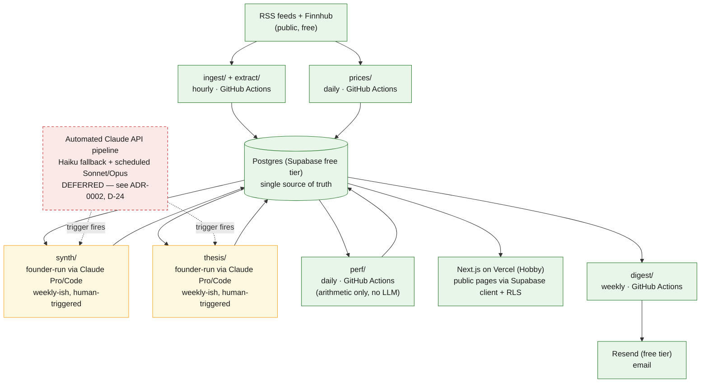

# Architecture

*This document covers system design — module boundaries, data flow, and deployment. Tool-by-tool rationale and trade-offs live in [`TECH_STACK.md`](TECH_STACK.md). It implements ADR-0001, Part 3 ("Updated architecture"), and the execution-mode and operating-notes changes in ADR-0002. Decisions are cited inline as "ADR-0001, D-XX" or "ADR-0002, D-XX."*

## Guiding principle

Clear module boundaries inside one codebase, not a distributed system — and, following ADR-0001 D-04, not even a single standing backend service. With zero users, the maintainability a growing codebase needs comes from well-defined internal seams (`ingest/`, `extract/`, `prices/`, `synth/`, `thesis/`, `perf/`), not from a deployed API tier separating "backend" from "frontend." The original plan for this document called that seam pattern a modular monolith; ADR-0001 goes one step further and removes the monolith's one deployed service entirely, since nothing in the MVP needs it (see "Backend," below). Split into standalone services later, when a specific scaling or team-ownership problem actually demands it — not preemptively, and not by default at the next milestone.

A second, load-bearing principle: the app never waits on an LLM call. Every AI-generated artifact — a topic, a thesis — is produced ahead of time (by a scheduled job, or, during the free-tier-first MVP, a founder-triggered session — ADR-0002, D-20) and stored in Postgres; Next.js only ever reads pre-computed data via the Supabase client. This keeps page loads fast and cheap regardless of how slow, expensive, or manual the AI pipeline's current execution mode is, and it's why no LLM call ever appears in a request path (see Load-bearing invariants, below).

## Frontend

Next.js (App Router) + TypeScript + Tailwind + shadcn/ui, deployed on Vercel.

Following ADR-0001 D-04, the frontend has no backend API to call. Public pages read Postgres directly through the Supabase client, protected by row-level security policies — the same capability a thin FastAPI read layer would have provided, at the cost of one fewer deploy target, one fewer CI path, and no OpenAPI contract to keep in sync. Where a request needs logic beyond a straightforward filtered read — an aggregation, a computed field — a Postgres function exposed as a Supabase RPC is the first option, not a reason to reach for a backend service.

One codebase, server components suit a data-heavy publication well, and this stack has the deepest support from AI coding tools, which matters directly for build speed.

## Backend

There is no deployed backend service in the MVP.

The original plan called for Python + FastAPI specifically because portfolio-return math and content/company joins are easier in pandas than in a Node backend. That reasoning survives for Python itself — the ingestion, extraction, and thesis-generation jobs described below are Python regardless — but it doesn't survive for a deployed HTTP service on top of it. The actual portfolio math is `Σ(weight × price_now / price_entry) − 1`; it doesn't need a service, and Postgres plus the Supabase client cover every read the frontend needs (ADR-0001, D-04).

What's deferred, specifically, is a standing FastAPI service and the Railway hosting that would run it — not Python, and not the jobs. Full rationale and the reinstatement trigger: `docs/TECH_STACK.md`.

## Database

Postgres via Supabase.

Supabase bundles authentication in the same product. Per ADR-0001 D-07, that auth capability is provisioned but intentionally unused in the MVP: every topic and thesis page is public and anonymous, and the only identity captured is a voluntarily submitted email address for the weekly digest. Auth activates only once there's genuinely user-specific state to protect — watchlists or saved portfolios, starting at M5.

Neon remains the noted alternative specifically if per-branch database copies become valuable to the workflow; nothing in this plan currently needs that, so the decision stays deferred rather than made.

No dedicated vector database. Postgres with the `pgvector` extension is the escalation path if prompt-level topic-continuity resolution (`docs/AI_SYSTEM.md`) proves insufficient — still inside Postgres, never a standalone Pinecone or Weaviate instance (ADR-0001, D-12).

## Schema

Seven tables plus two joins: `content_items`, `companies`, `topics`, `theses`, `positions`, `price_snapshots`, `performance_snapshots`, `topic_content_items`, `content_item_company_mentions` — trimmed from the original plan's larger schema per ADR-0001 D-05 and D-06. Full field-level detail, the holding-period rule, and the dual-benchmark columns: `docs/DATA_MODEL.md`.

## Background jobs

Six scheduled jobs, each a Python script triggered by GitHub Actions on its own cadence, replace what the original plan described as cron-triggered scripts on Railway:

| Job | Cadence | Reads | Writes |
|---|---|---|---|
| `ingest/` | Hourly | RSS feeds | `content_items` (deduped) |
| `extract/` | Hourly | New `content_items` | ticker/company mentions (rule-based only during free-tier-first — LLM fallback deferred, ADR-0002 D-20) |
| `prices/` | Daily | Finnhub | `price_snapshots` |
| `synth/` | Founder-triggered, ~weekly during free-tier-first¹ | Recent `content_items`, active topics | `topics` (created or updated, with continuity resolution) |
| `thesis/` | Founder-triggered, ~weekly during free-tier-first¹ | Topics past the momentum threshold, `price_snapshots` | `theses`, `positions` |
| `perf/` | Daily | `positions`, `price_snapshots` | `performance_snapshots` |

¹ Reverts to every-6-hours / daily automation once ADR-0002, D-24's reinstatement trigger fires. Until then, "job" here means a prompt the founder runs personally through Claude Code or claude.ai, not a cron trigger — see `docs/AI_SYSTEM.md` for the execution-mode notes under each agent.

A seventh, lightweight job — `digest/`, weekly — queries Postgres for the week's published theses and triggers the Resend email. Like every other job, it runs on schedule, independent of any page load; nothing about sending the digest should ever block or depend on a user request.

`prices/` and `perf/` ship alongside `ingest/` in M1/M2 — deliberately ahead of `synth/` and `thesis/` being trustworthy — because cached daily price history is the one component in this plan whose value accrues with elapsed time rather than with pipeline quality (ADR-0001, D-03; `docs/ROADMAP.md`). By the time `thesis/` opens its first position, weeks of price history already exist for every tracked company.

Nothing here needs sub-minute latency; hourly ingestion and once-daily performance snapshots are both generous relative to how fast investment narratives actually move. Celery and Redis are deferred until retries or real concurrency needs appear — GitHub Actions' own scheduling covers the MVP's needs (`docs/MVP_SCOPE.md`; `docs/TECH_STACK.md`).

### Free-tier operating notes (ADR-0002, D-23)

Two behaviors of the free infrastructure this plan runs on are worth naming explicitly, so they read as expected operating conditions rather than incidents:

- **GitHub Actions disables scheduled workflows in a public repository after 60 days with no commits** — specifically commits, not job runs. A pipeline writing to Supabase every hour on schedule still goes quiet if the repository itself sees no new commits for two months. A lightweight monthly keepalive workflow (touching and committing a timestamp file) closes this for near-zero effort; if one isn't set up, manually re-enabling the workflow from the Actions tab after a quiet stretch is an acceptable, occasional task.
- **Supabase pauses a free project after 7 days with no database activity.** In practice this never triggers while the scheduled jobs are running — hourly ingestion alone resets the clock well inside the window. It only becomes relevant after GitHub Actions has already gone quiet for the reason above; it's the second domino, not the first. Resuming a paused project is a one-click dashboard action with roughly a 30-second cold start.

Neither behavior is a defect in this plan — both are normal, well-documented consequences of running on free infrastructure, and both are cheap to prevent or reverse.

## Data ingestion

| Source | Approach | Status |
|---|---|---|
| RSS / news | Scheduled parse of 10–15 curated finance feeds | In the MVP — free, stable, no meaningful rate limits, and the right place to prove the ingestion pipeline first |
| Market data | Finnhub (free tier), 60 calls/minute | In the MVP — real-time US quotes, fundamentals, and SEC filings, enough for an MVP |
| Reddit | Official Data API, free tier | Deferred (ADR-0001, D-10) |

Reddit's free tier is capped and restricted to non-commercial use; a commercial tier exists but starts in the five-figure-per-year range, which makes it a revenue-funded decision rather than an MVP dependency. Scraping is not a workaround — Reddit's terms explicitly prohibit it and the company actively defends against it (`docs/MVP_SCOPE.md`, Explicitly out of scope).

Deferring the *connector* doesn't defer the *question* it was meant to answer. During M0, a person reads the relevant subreddits directly — zero API calls, not a commercial use of the API — to answer the real question: does social chatter surface narratives meaningfully earlier than curated RSS? If M0 shows it doesn't, the licensing question evaporates along with the need for it. If it does, the commercial tier becomes a costed decision made on evidence rather than an assumption baked into week two (`docs/ROADMAP.md`, M0; `docs/MVP_SCOPE.md`).

## AI pipeline (summary)

Full detail in `docs/AI_SYSTEM.md`. In architectural terms: extraction, topic synthesis (with continuity resolution, ADR-0001 D-12), and thesis generation are the work done inside `synth/` and `thesis/` above — background jobs (or, during the free-tier-first MVP, founder-triggered sessions using the identical contracts — ADR-0002, D-20) that read from and write to Postgres, none of them in the request path of a page load. No multi-agent orchestration framework (LangGraph, CrewAI, AutoGen); this is a linear pipeline of typed prompts to Claude — via the API once the automated path is reinstated, or via Claude Code/claude.ai during the free-tier-first MVP — simpler to build and debug than a framework designed for autonomous multi-step planning on what is fundamentally a sequential problem.

## External services

| Service | Purpose | Status |
|---|---|---|
| Claude Pro / Claude Code | Founder-run extraction fallback, topic synthesis, and thesis generation, via Cursor or claude.ai | MVP — current default (ADR-0002, D-20) |
| Claude API (Haiku/Sonnet/Opus, automated) | The fully automated version of the same pipeline stages, called from scheduled jobs | Deferred — reinstated per ADR-0002, D-24 |
| Finnhub | Market data (free tier) | MVP |
| Supabase | Postgres + auth (auth provisioned, unused — D-07) | MVP |
| Vercel | Frontend hosting | MVP |
| GitHub Actions | Scheduled job execution | MVP |
| Resend | Weekly email digest | MVP — pulled forward, since the publication is the M3 deliverable itself, not an add-on to it (ADR-0001, D-18) |
| Sentry | Error tracking | MVP |
| PostHog | Product analytics | MVP |
| Reddit Data API | Content ingestion | Deferred (D-10) |
| Railway | Backend + worker hosting | Deferred — only relevant if FastAPI is reinstated (D-04) |
| Upstash | Redis, for background jobs | Deferred — only relevant once Celery is reinstated |

Full rationale and trade-offs behind each choice: `docs/TECH_STACK.md`.

## Deployment strategy

Vercel (frontend) + Supabase (database/auth) + GitHub Actions (scheduled jobs), with the same GitHub Actions setup running lint, type-check, and tests on every push. Railway drops out of the MVP stack entirely; there is no backend to host (ADR-0001, D-04).

No staging environment, no blue-green or canary deploys — that's infrastructure for a team and a traffic level this product doesn't have yet. Add it when a specific incident or team-size threshold makes the lack of it a real problem, not before.

## Load-bearing invariants

Five rules hold regardless of what else changes in this system:

1. **No LLM call in a request path, ever.** Every AI-generated artifact is produced ahead of time — by a scheduled job once the automated pipeline is reinstated, or by a founder-triggered session during the free-tier-first MVP (ADR-0002, D-20) — and stored in Postgres; the frontend only ever reads pre-computed data.
2. **Every performance figure derives from `price_snapshots` and the fixed 90-day holding rule.** Never a backtest, never a discretionary exit (`docs/DATA_MODEL.md`; ADR-0001, D-13).
3. **Every thesis claim carries a paraphrased citation with a source id; no verbatim source text is stored or displayed.** (ADR-0001, D-15; `docs/DATA_MODEL.md`.) True regardless of who or what runs the generation step.
4. **Every generation logs model version and prompt version.** The only mechanism that makes a post-hoc quality regression diagnosable after a model or prompt change (`docs/AI_SYSTEM.md`). During free-tier-first, recording this is the founder's responsibility when loading output by hand — there's no automated harness doing it for them, which is exactly why it stays a hard rule rather than a nice-to-have.
5. **A daily spend cap is enforced in code, not just alerted on.** Breaching it halts generation rather than degrading silently (ADR-0001, D-16; `docs/AI_SYSTEM.md`). Dormant, with nothing to enforce, while the pipeline runs on Claude Pro/Code at $0 (ADR-0002, D-20) — but the cap code is written and ready regardless, so it's already in place the moment ADR-0002, D-24's trigger reinstates metered API calls.

## System diagram

Green = automated, unattended, and free. Amber = founder-run, manual, and free. Red/dashed = the deferred, paid state this pipeline moves to once ADR-0002, D-24 fires.
