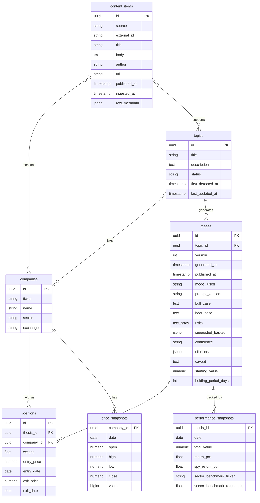

# Data model

*This document implements ADR-0001, Part 3 ("Schema") and the schema-related decisions in Part 4 (D-05, D-06, D-13, D-14, D-15). System-level context — how these tables get written to and read — is in [`ARCHITECTURE.md`](ARCHITECTURE.md); decisions are cited inline as "ADR-0001, D-XX."*

## Overview

The schema organizes around three clusters: ingestion and reference data (where content and companies come from), topics (what's synthesized from that content), and theses with their tracking data (what the AI concludes, and how that conclusion is measured against reality going forward). The original plan had a fourth, separate portfolios cluster; it's gone as a distinct concept below, because every MVP portfolio is now just a thesis's own tracking data, not a separate object with its own lifecycle (see Consolidation notes).

## Schema diagram

## Consolidation notes

Three structural changes go beyond what ADR-0001 spells out field-by-field, made to hit the ADR's own stated target of seven core tables plus two joins (ADR-0001, Part 3) without either padding the schema back out or working against the ADR's more granular guidance on individual fields (ADR-0001, D-05). Each is a deliberate simplification, not an oversight — flagged here specifically because it's a judgment call, not a transcription:

- **`Portfolio` is gone as a separate table.** Every MVP portfolio is system-generated, one per published thesis, with no user ownership (ADR-0001, D-05: cut `Portfolio.user_id`). Once that's true, a `portfolios` row exists in a permanent, unbreakable 1:1 relationship with a `theses` row — a strong signal it isn't a separate entity at all. `positions.thesis_id` now points directly at `theses`; the portfolio-level fields that mattered (a starting notional value, the holding-period rule) are now columns on `theses` itself. Real, user-owned portfolios return as their own table once M6 actually needs one (see Deferred entities).
- **Citations live on `theses` as structured JSONB, not a separate `thesis_citations` table.** The thesis generator's own output already represents citations as an array (`docs/AI_SYSTEM.md`), and every citation's lifecycle is identical to its parent thesis's — it's never queried, updated, or deleted independently. A normalized table buys database-enforced referential integrity; a JSONB array buys a direct match to the pipeline's actual output shape and one fewer join on every thesis page. The weekly manual QA process (`docs/MVP_SCOPE.md`) reads whole theses, not citations in isolation, so the JSONB shape costs nothing in practice today.
- **Sources are a config file, not a table.** Ten to fifteen curated, hand-picked RSS feeds that change rarely and deliberately don't need a database row with an admin UI behind it — a version-controlled list (feed name, URL, active flag) reviewed the same way any other code change is reviewed does the job with less schema. `content_items.source` stores a plain identifier matched against that list, not a foreign key.

One more table is simply absent rather than folded: there is no `users` table. Per ADR-0001 D-07, the MVP has no user-specific state to attach to one — Supabase's own `auth.users` schema is provisioned and sits ready for M5, and the app schema doesn't need its own copy of it before then. Digest subscriber emails are managed as an audience list in Resend itself, not a Postgres table.

Momentum is gone as a stored field for a different reason — not consolidation, but resolving a real contradiction. The original schema gave momentum its own persisted `momentum_score` column and paired it with a `SentimentSnapshot` table, while `docs/RISKS.md` calls sentiment tracking commoditized and not worth disproportionate investment. ADR-0001 D-06 resolves this in favor of the simpler mechanism: momentum is `count(content_items linked to a topic in the trailing 48h)` compared against a trailing baseline, computed in a query, stored nowhere. `SentimentSnapshot` is cut entirely.

*Note: this set of decisions means the "seven tables" line in `docs/ARCHITECTURE.md` and the schema below are consistent with each other, but that consistency depends on the three folds above. If a reviewer would rather keep `portfolios`, `sources`, or `thesis_citations` as standalone tables, that's a reasonable position — it would just mean revisiting the table count stated in `docs/ARCHITECTURE.md` to match.*

## Ingestion and reference data

### content_items

| Field | Type | Notes |
|---|---|---|
| id | uuid (PK) | |
| source | string | Matches an entry in the maintained feed list (config, not a foreign key — see Consolidation notes) |
| external_id | string | Dedupe key from the origin platform |
| title | string | |
| body | text | |
| author | string | Nullable |
| url | string | |
| published_at | timestamp | |
| ingested_at | timestamp | |
| raw_metadata | jsonb | Source-specific fields not otherwise modeled |

### companies

| Field | Type | Notes |
|---|---|---|
| id | uuid (PK) | |
| ticker | string | |
| name | string | |
| sector | string | |
| exchange | string | |

Unchanged from the original plan.

### content_item_company_mentions (join)

Links a `content_items` row to the `companies` it mentions, with an extraction confidence score. Many-to-many: one item can mention several companies; one company is mentioned by many items.

## Topics

### topics

| Field | Type | Notes |
|---|---|---|
| id | uuid (PK) | |
| title | string | LLM-generated |
| description | text | LLM-generated summary |
| status | enum | `active`, `archived` — collapsed from four states (ADR-0001, D-05). "Emerging" vs. "trending" is now a read-time query over mention counts, not stored state |
| first_detected_at | timestamp | |
| last_updated_at | timestamp | Drives the archival rule: a topic with no newly linked content for N days flips to `archived` (`docs/AI_SYSTEM.md`, Topic continuity) |

No `momentum_score` column. Momentum is computed at read time — see Consolidation notes.

### topic_content_items (join)

Links a `topics` row to the `content_items` that support it, with a relevance score. This is what makes every topic's "why is this trending" claim traceable back to real source material.

## Theses

### theses

| Field | Type | Notes |
|---|---|---|
| id | uuid (PK) | |
| topic_id | uuid (FK → topics) | |
| version | int | Kept deliberately (ADR-0001, D-05) — the only mechanism that makes a post-hoc quality regression diagnosable |
| generated_at | timestamp | |
| published_at | timestamp | Nullable. Replaces the original `draft`/`published` status enum (ADR-0001, D-05) — one publisher, one moment of publication |
| model_used | string | Kept deliberately (ADR-0001, D-05), for auditability across model upgrades |
| prompt_version | string | Kept deliberately (ADR-0001, D-05) |
| bull_case | text | |
| bear_case | text | |
| risks | text[] | |
| suggested_basket | jsonb | Naive equal-weight allocation across linked companies — not a personalized recommendation (`docs/RISKS.md`) |
| confidence | enum | `low`, `medium`, `high` |
| citations | jsonb | Array of `{content_item_id, source_url, publisher, headline, published_at, paraphrase}` — paraphrase only, never a verbatim excerpt (ADR-0001, D-15). See Consolidation notes for why this is JSONB rather than its own table |
| caveat | text | "This is a hypothesis for tracking purposes, not a recommendation" — a first-class stored field, not just UI copy |
| starting_value | numeric | The fixed notional value the hypothetical portfolio starts at; absorbed from the original `Portfolio` table (see Consolidation notes) |
| holding_period_days | int | Defaults to 90. Stored per-thesis rather than hardcoded, specifically so a future change to the rule applies only to theses published after the change — never retroactively (ADR-0001, D-13) |

## Positions and performance

### positions

| Field | Type | Notes |
|---|---|---|
| id | uuid (PK) | |
| thesis_id | uuid (FK → theses) | Replaces the original `portfolio_id` — see Consolidation notes |
| company_id | uuid (FK → companies) | |
| weight | float | |
| entry_price | numeric | |
| entry_date | date | The next trading close after the thesis's `published_at` |
| exit_price | numeric | Nullable — null while still held. Kept deliberately (ADR-0001, D-05): the fixed holding period requires an exit, so this field is load-bearing from week one |
| exit_date | date | Nullable. `entry_date + thesis.holding_period_days`, adjusted forward to the next trading day if that date falls on a weekend or market holiday (`docs/RISKS.md`, Market calendar handling) |

### price_snapshots

| Field | Type | Notes |
|---|---|---|
| company_id | uuid (FK → companies) | |
| date | date | |
| open / high / low / close | numeric | |
| volume | bigint | |

Cached daily bars — the single source of truth for all performance calculations, so tracking is fast, consistent, and doesn't repeatedly hit the market data API. Unchanged from the original plan.

### performance_snapshots

| Field | Type | Notes |
|---|---|---|
| thesis_id | uuid (FK → theses) | Replaces the original `portfolio_id` — see Consolidation notes |
| date | date | |
| total_value | numeric | |
| return_pct | float | |
| spy_return_pct | float | The broad-index comparison readers expect and understand |
| sector_benchmark_ticker | string | Which sector or thematic ETF was used for this specific thesis — see Dual benchmarks, below |
| sector_benchmark_return_pct | float | The comparison that isolates narrative selection from broad market movement |

Computed daily by the performance job described in `docs/ARCHITECTURE.md` (`perf/`) — this table powers every performance chart in the product and is the entire mechanism behind the accountability claim described in `docs/VISION.md`.

## The 90-day holding rule

A fixed rule, written down before the first position ever opens, and applied mechanically, with no discretionary exits (ADR-0001, D-13):

1. A position enters at the next daily close after its thesis's `published_at`.
2. It holds for `theses.holding_period_days` (90, by default) calendar days.
3. It exits at the close on that day — or the next trading day, if day 90 falls on a weekend or market holiday (`docs/RISKS.md`, Market calendar handling).
4. Nothing about a topic cooling, archiving, or a thesis being revisited changes an already-open position. The rule that opened it is the rule that closes it.

The holding period lives on `theses`, not hardcoded in application code, so that if the rule itself is ever revisited, the change is logged and applies only to theses published after the change — never retroactively re-timed for positions already open (ADR-0001, D-13; `docs/AI_SYSTEM.md`, Evaluation engine). Boring and defensible beats clever and unfalsifiable.

## Dual benchmarks

Every `performance_snapshots` row reports return against two fixed comparisons, never one (ADR-0001, D-14):

- **`spy_return_pct`** — SPY, the comparison most readers already understand.
- **`sector_benchmark_return_pct`**, identified by **`sector_benchmark_ticker`** — a sector or thematic ETF matched to the thesis's linked companies.

SPY alone measures beta: in a rising market, an equal-weight basket of narrative stocks looks prescient regardless of whether the underlying thesis was any good. The sector or thematic comparison isolates the thing this product actually claims skill at — picking the narrative, not riding the market. Both numbers are shown together, always; neither is presented as the whole story on its own.

## Deferred entities

Nothing here is rejected — it's unbuilt, with a trigger that brings it back (`docs/MVP_SCOPE.md`), so the year-two shape of this schema isn't lost, just not yet needed:

- **`portfolios`, with a real `user_id`.** Returns once user-created, editable portfolios ship (M6) — a genuinely separate table at that point, since portfolios would no longer be in a 1:1 relationship with a thesis.
- **`profiles`** (or direct use of Supabase's `auth.users`). Returns once any user-specific state exists to attach to it — watchlists, saved portfolios (M5).
- **`watchlists`** — a join between a user and the topics they follow. M5, alongside auth.
- **`sources`, as a real table.** Returns if feed management ever needs to happen without a code review — more sources, more frequent changes, or a non-technical person managing the list.
- **`thesis_citations`, as its own table.** Returns if citations are ever queried independently of their parent thesis at a scale or frequency where a JSONB array stops being the right tool — for instance, cross-thesis citation analytics, or enforcing referential integrity against `content_items` at the database layer rather than in application code.
- **A `sentiment`/momentum-scoring subsystem.** Not really deferred so much as resolved against (ADR-0001, D-06) — momentum stays a query, not a stored score, unless a genuinely new capability, not just a revival of the original design, makes a case for it.
